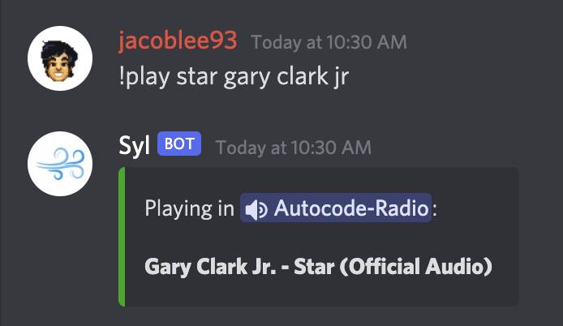
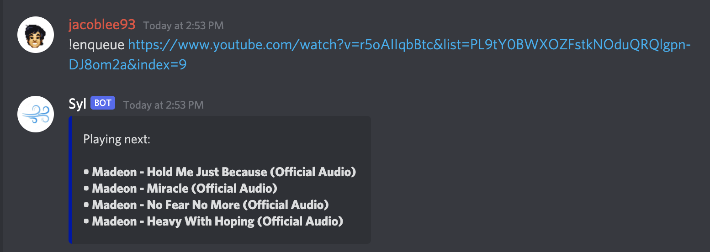
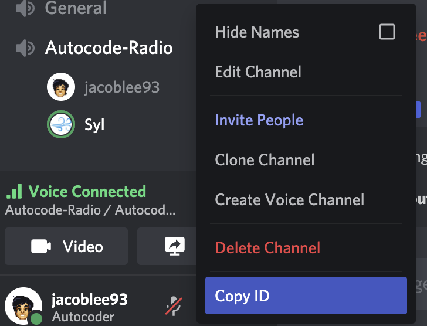

# NonToxic Discord Music Bot

This app allows you to play audio tracks in a Discord voice channel
of your choice:

It also contains a simple system for queueing tracks in advance:

You can search for tracks or enter a direct YouTube link!

# Setup

The only required setup is to get the id of a voice channel you would like to
designate as your server's "radio channel". You can find this id by right
clicking a voice channel in your server with developer mode enabled:

If you need help enabling developer mode, [see this section of the official guide](https://autocode.com/guides/how-to-build-a-discord-bot/#faq-1).

Otherwise, you just need to pick a prefix for your bot, and you're all set!

# Prefix Commands

All commands are shown with `!` as a prefix, but you can set whatever you'd like
during setup or afterwards by modifying the `PREFIX` environment variable.

- `!play <query>`: Play or search for a track
- `!play` Resume a paused track or play the latest track from the queue if the player is disconnected
- `!pause`: Pause the currently playing track
- `!disconnect`: Disconnect the bot from the voice channel
- `!nowplaying`: Retrieve the current track and queued tracks
- `!queue`: Same as `!nowplaying`
- `!enqueue <query>`: Add a track to the queue
- `!skip`: Skip currently playing track and play the next track in the queue
- `!clearqueue`: Clear the current queue
- `!help`: Bring up help menu

Queued tracks automatically play when the last track finishes.

# Troubleshooting

This app uses the [ytdl-core](https://github.com/fent/node-ytdl-core) npm package
to stream from YouTube, which is frequently updated as YouTube makes changes. 
If your bot has issues downloading a particular track, try again later or check 
for an updated version of the dependency.

# Thank You!

If you have any questions or feedback, please join our community Discord 
from the Community tab in the top bar. You can also follow us on Twitter, 
[@AutocodeHQ](https://twitter.com/AutocodeHQ).
